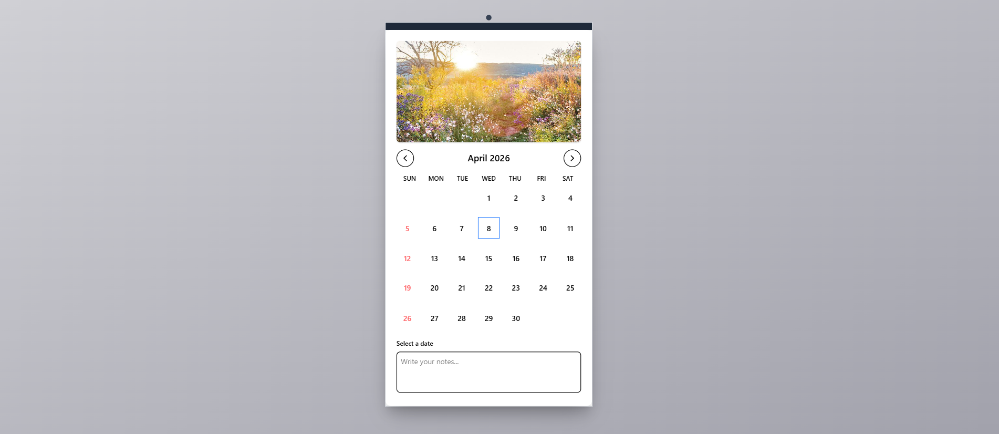

# 📅 Calendar

## 📖 Description

A responsive calendar web app that allows users to select single dates or date ranges and store notes.

## ✨ Features

* 📅 Monthly calendar view
* 🖱️ Select single date or date range
* 📝 Add notes for selected dates
* 📱 Fully responsive design

## 🛠️ Tech Stack

* React.js
* Tailwind CSS
* JavaScript

## 🚀 Installation & Setup

1. Clone the repository
   git clone https://github.com/adityazinj/calender.git

3. Install dependencies
   npm install

4. Run the app
   npm run dev

## 📸 Screenshots

## 👨‍💻 Author

Aditya Zinjurke
